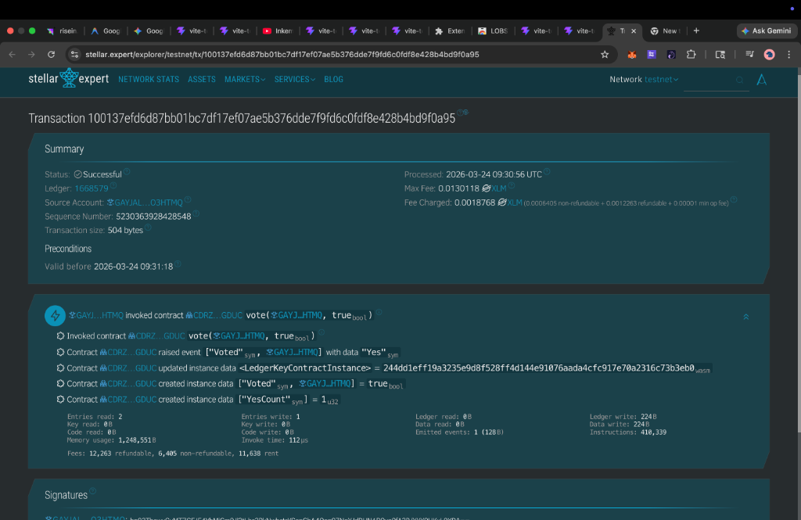
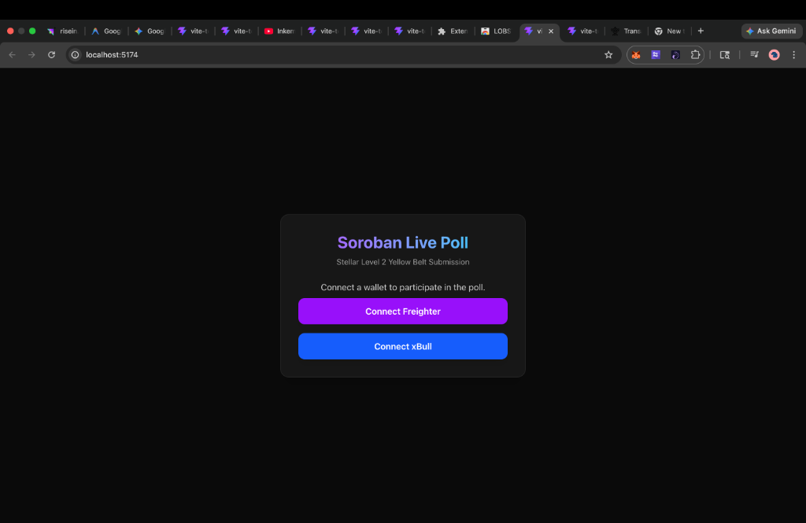
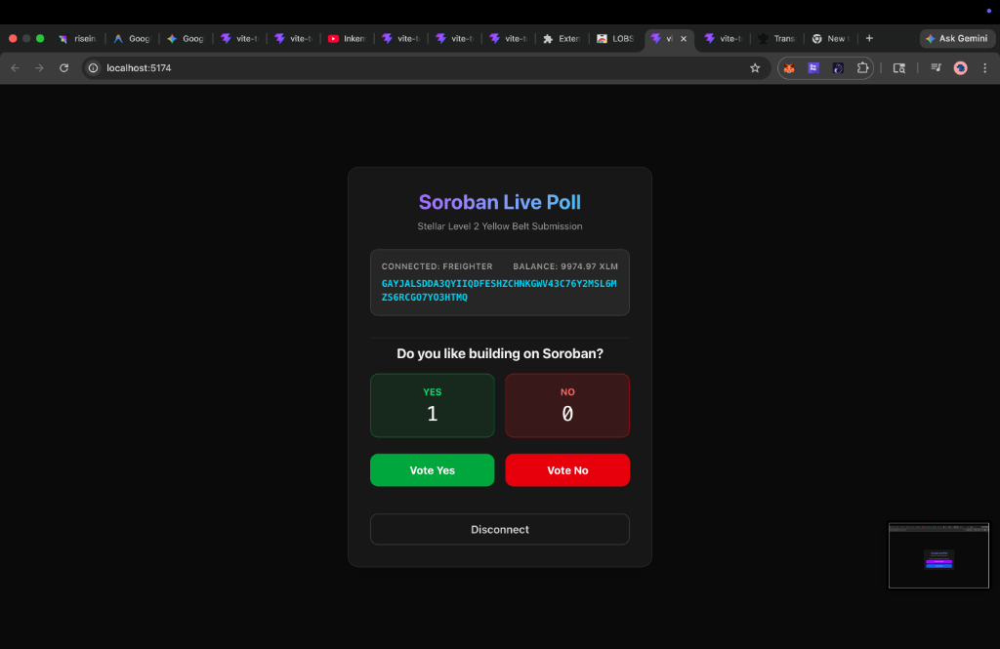
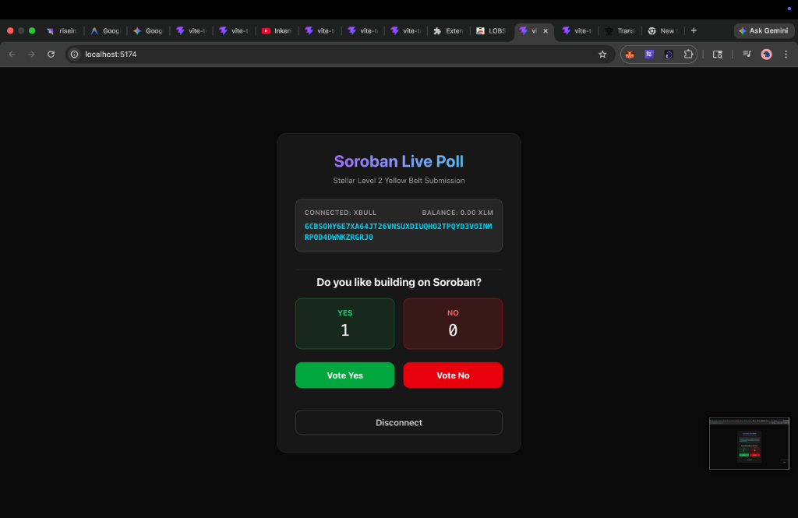

# Stellar Level 2 - Yellow Belt Submission: Soroban Live Poll

This project implements a Live Poll decentralized application (dApp) on the Stellar Testnet, built with React, Vite, and Soroban smart contracts. It successfully integrates `StellarWalletsKit` to interact with multiple wallets (Freighter, xBull), processes transactions on the Stellar network, and synchronizes real-time contract state.

## 📝 Features
- **Multi-Wallet Integration**: Connects to both Freighter and xBull using `@creit.tech/stellar-wallets-kit`.
- **Smart Contract Deployment**: Custom Soroban Rust smart contract deployed on the Stellar testnet.
- **Contract Interaction**: Read (`get_votes`) and Write (`vote`) methods invoked from the frontend using the new Soroban RPC SDK.
- **Robust Error Handling**: Handle "Wallet Not Found", "User Rejected", and "Already Voted" (simulation traps).
- **Real-time Event Synchronization**: Periodically polls the smart contract state to update vote counts seamlessly.

## 🏁 Submission Deliverables
### 1. Smart Contract Performance
The contract is live on the **Stellar Testnet** and correctly enforces one-vote-per-wallet.
- **Contract ID:** `CDRZCJDK7G5U4PBKLTPQL4ENKLPHHJJ4A75G6OFPKBPFPHIDRP73GDUC`
- **Proof of successful vote call (Stellar Expert):** [View Transaction on Stellar Expert](https://stellar.expert/explorer/testnet/tx/100137efd6d87bb01bc7df17ef07ae5b376dde7f9fd6c0fdf8e428b4bd9f0a95)



### 2. Multi-Wallet UI implementation
The frontend detects and connects to both Freighter and xBull wallets gracefully.

| Initial Screen | Freighter Connected | xBull Connected |
| :---: | :---: | :---: |
|  |  |  |

---

## 🚀 Setup Instructions
1. Clone the repository.
2. Install dependencies:
   ```bash
   npm install
   ```
3. Start the development server:
   ```bash
   npm run dev
   ```
4. Open your browser to `http://localhost:5173`.
5. Ensure your wallet extension (Freighter or xBull) is set to **Testnet** and funded with at least 2 XLM.

Enjoy the Live Poll dApp!
