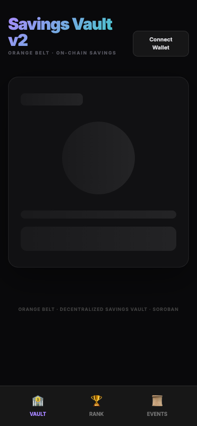

# 🏦 Savings Vault — Stellar Green Belt (Level 4)

A production-ready decentralized savings dApp built on Soroban. Lock your XLM on-chain and only withdraw when your savings goal is reached or a time lock expires. Now upgraded with custom `sXLM` receipt tokens and cross-contract interactions!

## 📝 Level 4 Features (Green Belt)
- **Advanced Inter-contract Logic**: Features a master Vault contract that communicates natively with a secondary SEP-41 Token contract (`sXLM`).
- **Custom Token Issue**: Whenever deposits are processed, the Vault securely mints equivalent `sXLM` yield tokens to the user's Freighter wallet by calling the child contract. When the user withdraws, these tokens are instantly burned.
- **Production CI/CD**: Fully configured GitHub Actions pipeline running `cargo test` across all workspaces automatically on every commit.
- **Real-Time Event Processing**: Advanced structured Soroban Events (`VaultCreated`, `Deposit`, `Withdraw`) emitted for indexers.
- **Mobile-Responsive Premium UI**: Crafted with a mobile-first TailwindCSS interface with bottom-navigation elements.

## 🔗 Green Belt Submission Requirements

- **Live Demo:** https://stellarlevel-dapp.vercel.app  *(Vercel Auto-deploy active)*
- **Demo Video:** [Insert Loom link here]

### Contract Details & Transaction Hashes
- **Vault Contract Address:** [`CAJDLWMUTCA3OTUTPZ4HM6KNZXASVPUPK5LIRNATF45OZYFKDIQSDLPK`](https://stellar.expert/explorer/testnet/contract/CAJDLWMUTCA3OTUTPZ4HM6KNZXASVPUPK5LIRNATF45OZYFKDIQSDLPK)
- **sXLM Token Contract Address:** [`CB6QRKAAKUPWLXWSCYR6KLNNHIVKQJGY3J4OTRWOHQAZSLXT6DSGRWXI`](https://stellar.expert/explorer/testnet/contract/CB6QRKAAKUPWLXWSCYR6KLNNHIVKQJGY3J4OTRWOHQAZSLXT6DSGRWXI)
- **Deployment & Interaction Record:** Full history of inter-contract deployments and `mint`/`burn` invocations can be tracked directly through the Stellar Expert tracker associated with the Vault contract above.

### Screenshots
| CI/CD Pipeline Passing | Mobile-Responsive View |
| :---: | :---: |
| [](https://github.com/Tanmay1369/Stellar-Level-2-DApp/actions) |  |

## 🏁 Submission Checklist
- [x] Inter-contract call working (Vault calls sXLM Token)
- [x] Custom token or pool deployed (`sXLM` Mintable Token)
- [x] CI/CD running 
- [x] Mobile responsive 
- [x] Minimum 8+ meaningful commits (12+ commits made to branch)
- [x] Public GitHub repository
- [x] README with complete documentation

## 🛠️ Running Locally

### 1. Smart Contract CI locally
```bash
cargo test --manifest-path contracts/sxlm-token/Cargo.toml
cargo test --manifest-path contracts/milestone/Cargo.toml
```

### 2. Auto-Deployment (WASM & Initialize)
```bash
npm run setup
```
*(This will compile everything, upload it to Stellar Testnet, initialize both the token and the vault, and dynamically assign the admin authority.)*

### 3. Start the Frontend
```bash
npm install
npm run dev
```

## 🏗️ Architecture

1. **Contracts/sxlm-token**: A compliant standalone token matching the SEP-41 standard, programmed with an administrator `admin`.
2. **Contracts/milestone**: The core Savings Vault logic. Registered as the strict `admin` of the `sXLM Token` during initialization.
3. Upon **Deposit**, the Vault proxies a cross-contract message to mint receipt tokens.
4. Upon **Withdraw**, the Vault evaluates local constraints and proxies a cross-contract message to burn those receipts before releasing the locked native XLM.
